### Relevancia

:::::: columns
:::: {.column .leftcol width="62%"}
::: slide-text
**Enfoque:** consumo de café y su vínculo con **sueño, estrés y rendimiento** (UTEC 2024-2).

-   El café se usa para sostener el estudio en semanas exigentes.
-   La frecuencia y el horario pueden afectar descanso y percepción de estrés.

### Objetivo general

Analizar los hábitos de consumo de café de todos los estudiantes de la UTEC durante el periodo académico **2024-2** y su relación con indicadores académicos y percepción del bienestar general.

### Objetivos específicos:

-   **OE1: Analizar la relación entre el consumo de café y los niveles de estrés percibidos**.

-   **OE2: Analizar la relación entre los patrones de sueño y el rendimiento académico**.

-   **OE3: Determinar si el ingreso a la universidad ha influido en los hábitos de consumo de café**.

**Unidad muestral:** Cada estudiante de la UTEC en el periodo 2024-2 que consume café.

*Muestreo por conveniencia.*
:::
::::

::: {.column .rightcol width="38%"}
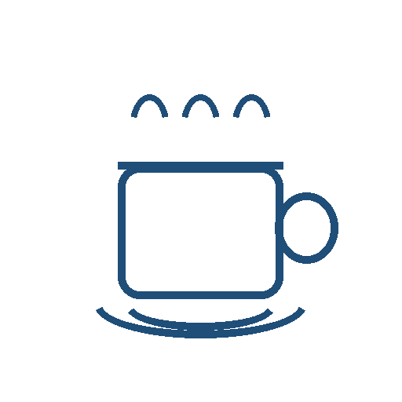{.icon fig-alt="Ícono de café"} 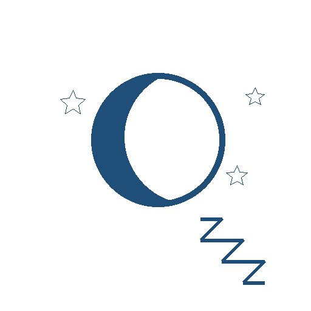{.icon fig-alt="Ícono de sueño"} {.icon fig-alt="Ícono de estrés"}
:::
::::::

## OE1: Café nocturno y estrés (**n = 933)** {.scrollable}

::: {.column .right width="100%"}
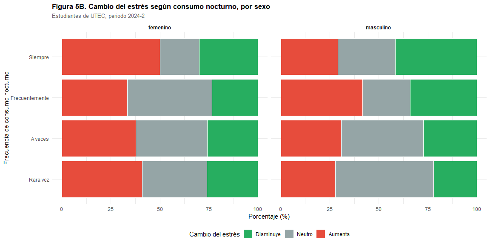
:::::

## OE1: Café diurno y estrés (**n = 933)** {.scrollable}

::::: columns
::: {.column .right width="100%"}
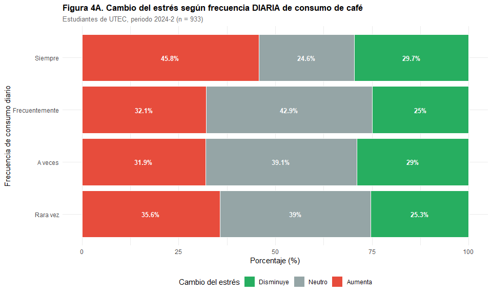
:::
:::::

## OE2: Sueño, cercanía del café y rendimiento (**n = 1248**) {.scrollable}

**Se observa significancia menor**

::: {.column .left width="50%"}
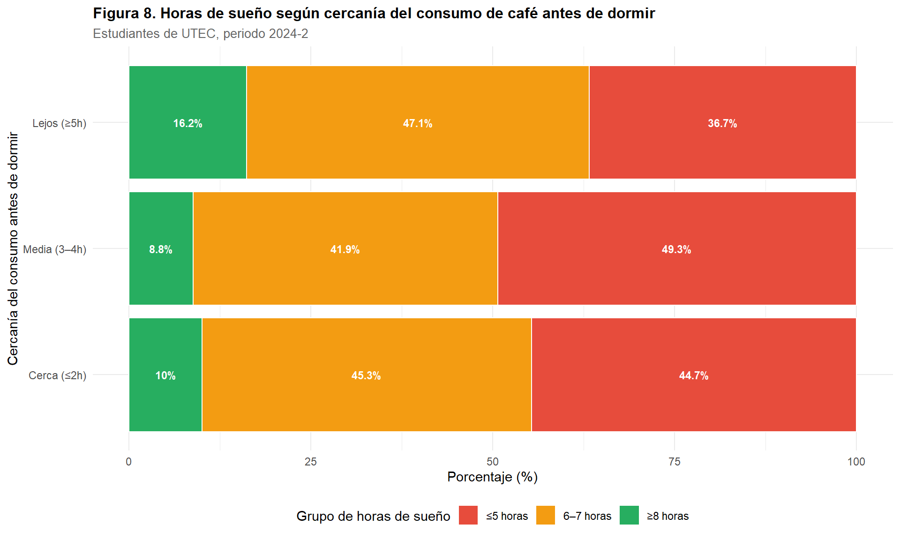
:::

::: {.column .right width="50%"}
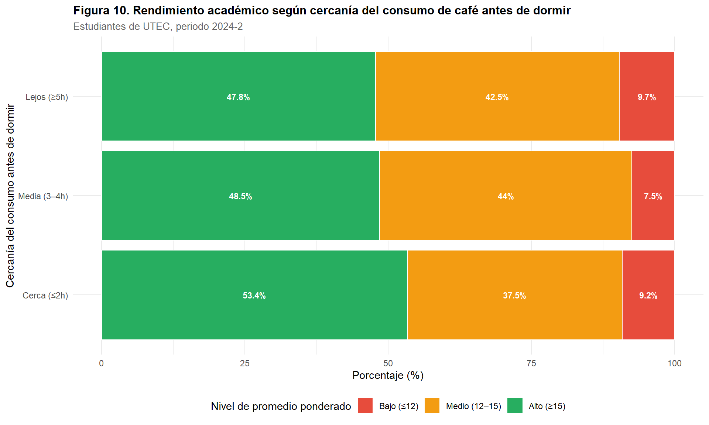
:::

## OE3: Cambio de consumo al ingresar a UTEC (n = 1248) {.scrollable}

:::::: columns
:::: {.column .left width="50%"}
::: slide-text
-   **64.8%** reporta aumento (48.7% + 16.0%).
-   Mayor salto: “Aumentó mucho” **Δ = +1.82**.

**Tabla 6 (resumen):** Cambio promedio (tazas/día)

| Cambio          |   n | Antes | Ahora |         Δ |
|:----------------|----:|------:|------:|----------:|
| Disminuyó mucho |  15 |  5.27 |  3.87 | **-1.40** |
| Disminuyó       |  43 |  2.72 |  2.60 | **-0.12** |
| Sin cambios     | 382 |  1.68 |  1.90 | **+0.22** |
| Aumentó         | 608 |  1.09 |  2.09 | **+1.00** |
| Aumentó mucho   | 200 |  1.08 |  2.90 | **+1.82** |
:::
::::
:::: {.column width="50%"}
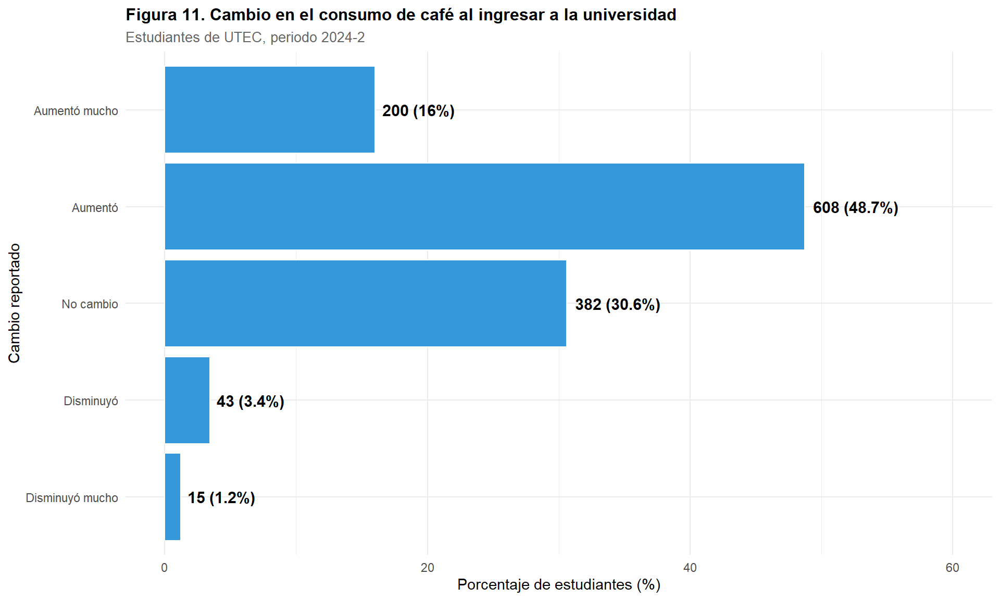
::::
::::::

## Probabilidad Empírica {.scrollable}

Variable: Frecuencia diaria de consumo

::::: columns
::: {.column .left width="50%"}
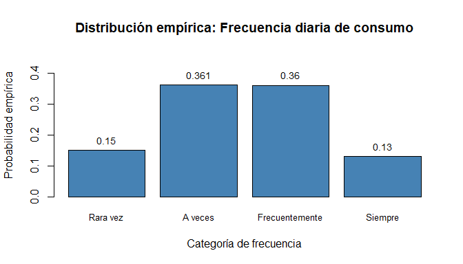
:::

::: {.column .right width="50%"}
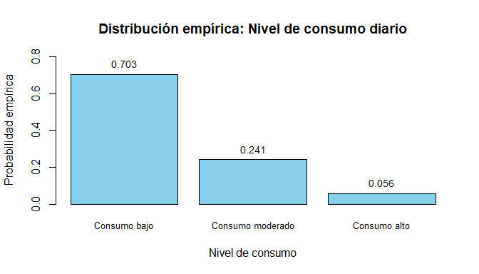
:::
:::::

## Probabilidad Condicional {.scrollable}

::: {.column width="80%"}
A ocurre si cambio_utec es “Aumentó” o “Aumentó mucho”

B ocurre si energia_1_a_5 es “4” o “5”
:::
::: {.column width="60%"}
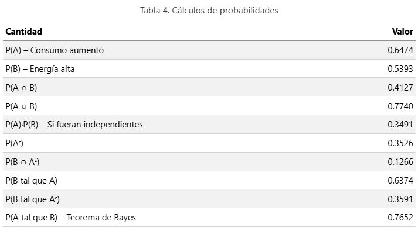
:::

## Discreta-Distribucion Binomial{.scrollable}

::: {.column width="50%"}

Si se seleccionan 30 unidades muestrales ¿cuál es la probabilidad de que exactamente 10 o al menos la mitad duerman ≥ 7h?

p = P(duerme ≥ 7h) = 0.2893, n = 30, Y = número de estudiantes que duermen ≥ 7h

Y = Binomial(n = 30, p = 0.2893)

Resultados

P(Y = 10, ≤ 5) → 13.33%, 9.62%

:::
::: {.column width="50%"}
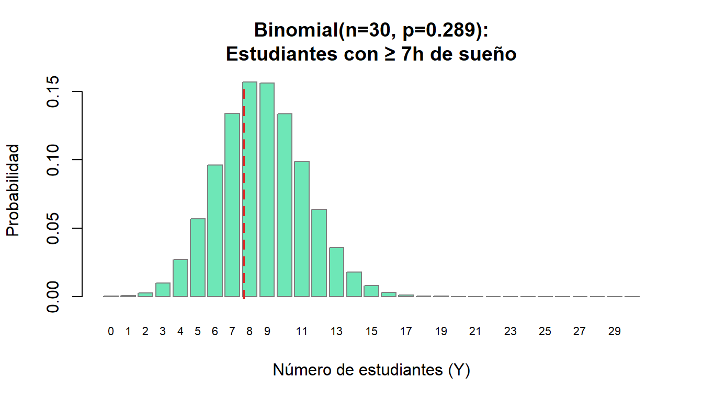
:::

## Continua {.scrollable}

Seleccionamos el promedio ponderado como variable.

::: {.column .left width="50%"}
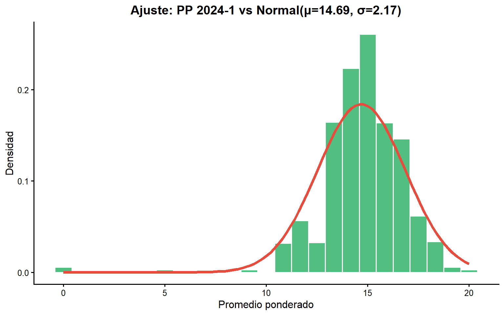
:::

::: {.column .right width="50%"}
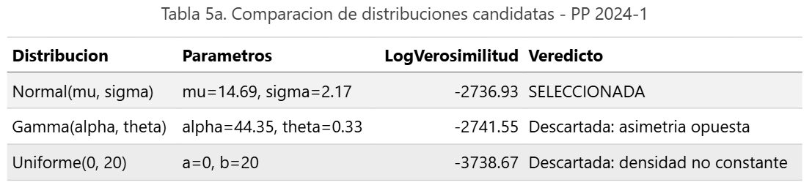
:::
P(13 ≤ Z ≤ 16) = 0.509 P(Z \< 11) = 0.0445 en riesgo académico (PP \< 11) es del 0.045 P(Z ≥ 17) = 0.1434 rendimiento destacado (PP ≥ 17) es del 0.14 Percentil 75: P₇₅ = 16.15

## Evaluación de la Normal

::: {.column .left width="60%"}
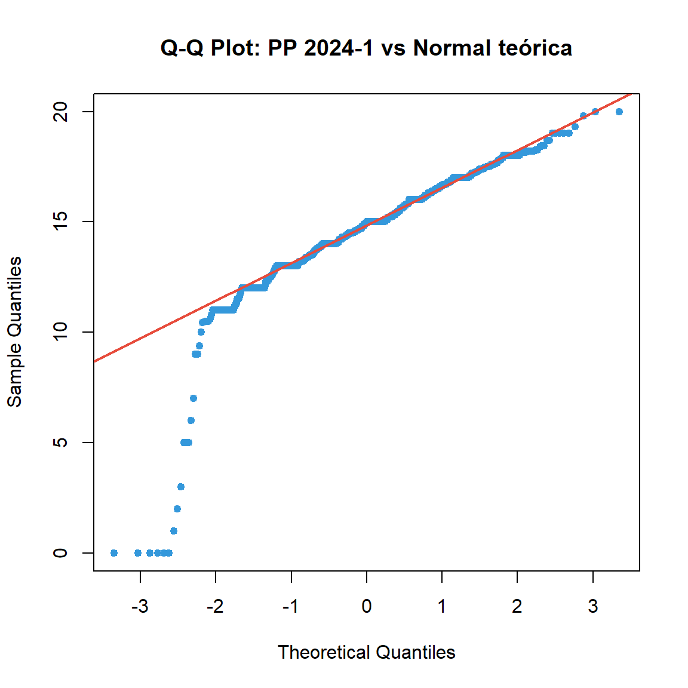
:::
::: {.column .right width="40%" style="font-size: 0.7em;"}
Limitación principal: El Q-Q plot es concluyente: la asimetría observada invalida el supuesto de normalidad.

Limitación del rango: El modelo Normal permite valores fuera de 0,20, lo cual es incongruente con la escala real.
:::

## GRACIAS

-   Alvarez Lovera, Sandra Sofia
-   Baquerizo Rojas, Valeria Marisol
-   Cose Rojas, Joseph Anderson
-   Oliden Serrato, Ronald Amir
-   Silvera Pastor, Jose Maria
